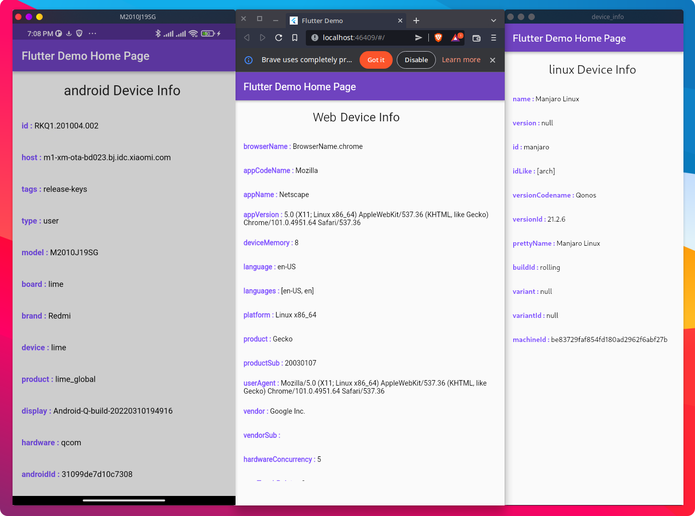

# Flutter device_info demo  

this is a demo application running [device_info_plus](https://pub.dev/packages/device_info_plus) package on all platforms , this is useful for checking avaiable device info and customizing your app based on the result .

## Getting Started

- clone this project  ` git clone  https://github.com/egyleader/device_info_demo.git `
- check available devices using `flutter devices`
- run app on your desired deviec using flutter run -d YOUR_DEVICE_ID
